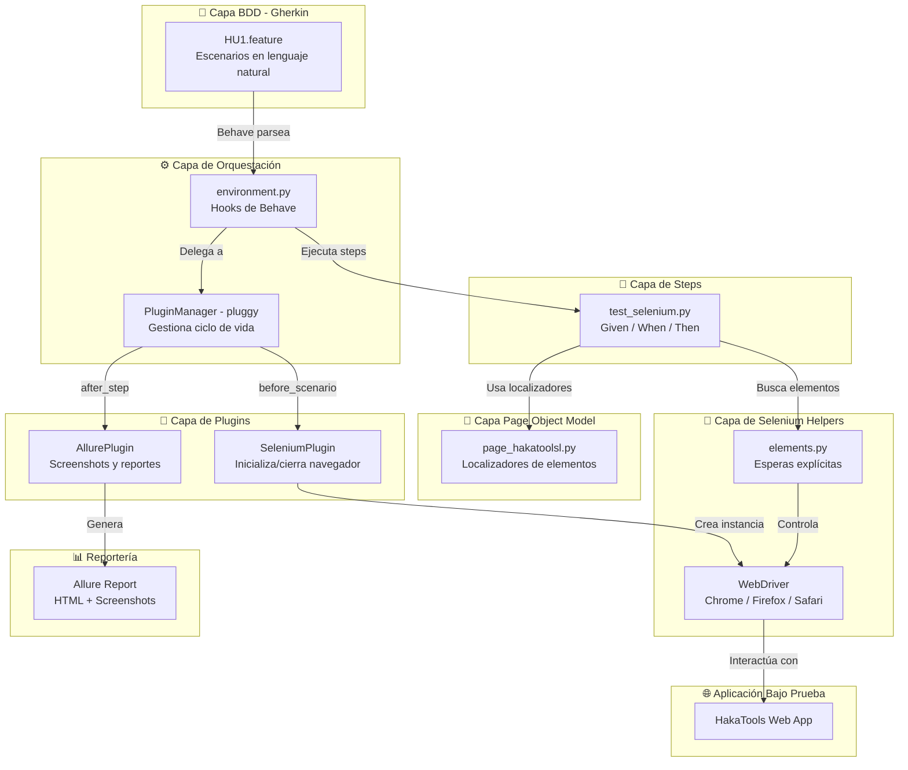
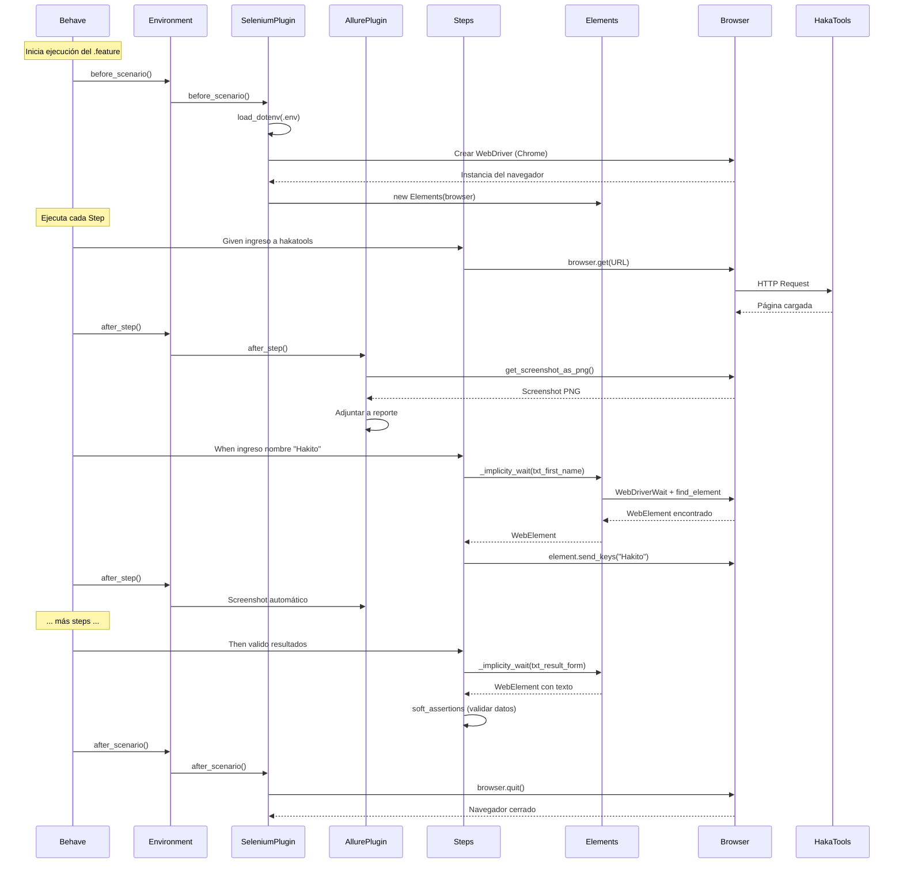
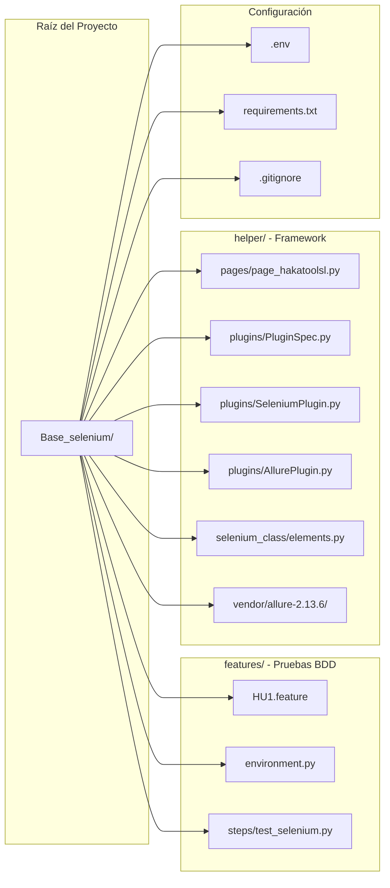

# Diagrama de Arquitectura - Framework de Automatización Web

Usa este contenido para generar un diagrama visual en herramientas como:
- [Mermaid Live Editor](https://mermaid.live)
- [Draw.io](https://app.diagrams.net)
- ChatGPT / Claude con generación de imágenes
- Excalidraw

---

## Diagrama Mermaid - Arquitectura General



---

## Diagrama Mermaid - Flujo de Ejecución por Escenario



---

## Diagrama Mermaid - Estructura de Carpetas



---

## Diagrama Mermaid - Sistema de Plugins (pluggy)

```mermaid
graph LR
    subgraph "Especificación (Contrato)"
        SPEC[PluginSpec.py<br/>Define QUÉ hooks existen<br/>@hookspec]
    end

    subgraph "Implementaciones"
        IMPL1[SeleniumPlugin<br/>@hookimpl<br/>before_scenario<br/>after_scenario]
        IMPL2[AllurePlugin<br/>@hookimpl<br/>before_all<br/>after_step<br/>after_all]
        IMPL3[Tu Nuevo Plugin<br/>@hookimpl<br/>...]
    end

    subgraph "Gestor"
        PM[PluginManager<br/>pluggy]
    end

    SPEC -->|add_hookspecs| PM
    IMPL1 -->|register| PM
    IMPL2 -->|register| PM
    IMPL3 -.->|register| PM

    PM -->|pm.hook.before_scenario| IMPL1
    PM -->|pm.hook.after_step| IMPL2
```

---

## Prompt para IA generativa de imágenes

Si quieres generar una imagen visual del diagrama, usa este prompt:

> Crea un diagrama de arquitectura de software limpio y profesional para un framework de automatización de pruebas web. El diagrama debe mostrar las siguientes capas de arriba hacia abajo:
>
> 1. **Capa BDD** (arriba): Archivos .feature escritos en Gherkin (lenguaje natural)
> 2. **Capa de Orquestación**: environment.py con PluginManager de pluggy
> 3. **Capa de Plugins**: SeleniumPlugin (gestiona navegador) y AllurePlugin (reportes con screenshots)
> 4. **Capa de Steps**: Funciones Python decoradas con @given, @when, @then
> 5. **Capa Page Object Model**: Clases con localizadores de elementos (By.ID, By.XPATH)
> 6. **Capa Selenium**: Esperas explícitas (WebDriverWait) y WebDriver
> 7. **Aplicación web** (abajo): HakaTools como sistema bajo prueba
> 8. **Salida lateral**: Allure Report con HTML y screenshots
>
> Estilo: colores suaves, flechas que muestren el flujo de datos, iconos representativos para cada capa. Orientación vertical. Fondo blanco.

---

## Notas para presentación

- El **diagrama de arquitectura general** es ideal para explicar la visión completa del framework
- El **diagrama de secuencia** es perfecto para mostrar qué pasa cuando se ejecuta un test paso a paso
- El **diagrama de plugins** ayuda a entender cómo extender el framework sin tocar el código existente
- Todos los diagramas Mermaid se pueden pegar directamente en GitHub, GitLab, Notion o el [Mermaid Live Editor](https://mermaid.live)
